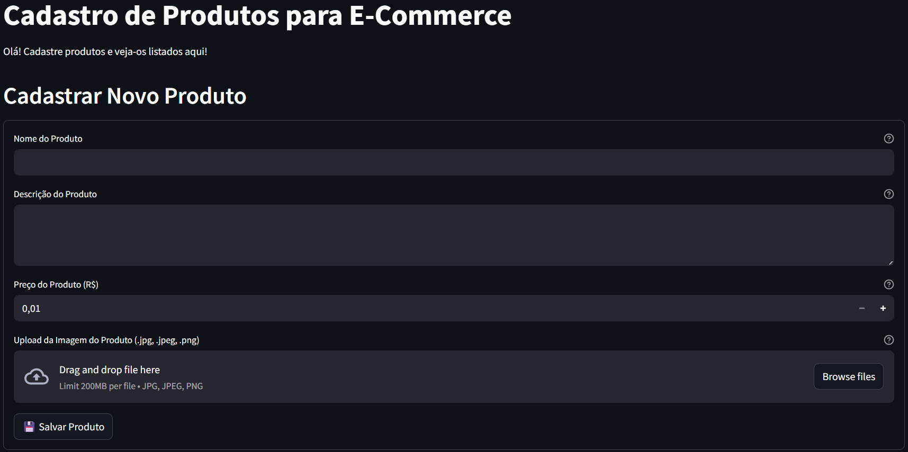
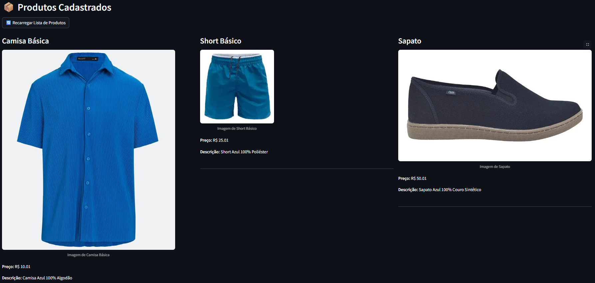
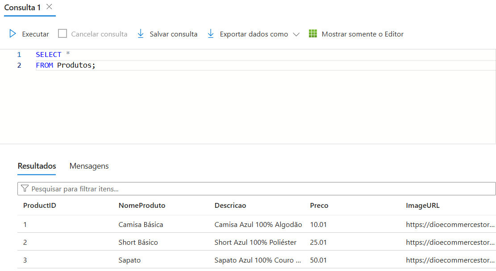

# Meu E-commerce de Produtos

Este projeto é um aplicativo Streamlit que simula um e-commerce simples, permitindo o cadastro e visualização de produtos, com armazenamento de imagens no Azure Blob Storage e dados no Azure SQL Database.

## Telas do Aplicativo

### Cadastro de Produtos
Aqui você pode cadastrar um novo produto, incluindo nome, descrição, preço e uma imagem.


*Captura de tela da funcionalidade de cadastro de produtos.*

### Visualização de Produtos
Após o cadastro, os produtos são exibidos na tela principal.


*Tela inicial mostrando produtos já cadastrados.*

## Tela de Consulta da Nuvem
Usando o comando SELECT * FROM Produtos; para visualizar a tabela.


*Resultado da consulta SQL no Azure SQL Database*

---

## Tecnologias Utilizadas

* Python
* Streamlit
* Azure Blob Storage
* Azure SQL Database
* pymssql
* python-dotenv

## Como Rodar o Projeto

Para configurar e rodar este projeto localmente, siga os passos abaixo:

1.  **Clone o repositório:**
    ```bash
    git clone https://github.com/RafaelRibeiro9666/armazenando-dados-de-um-e-commerce-na-cloud
    ```

2.  **Crie e ative um ambiente virtual (recomendado):**
    ```bash
    python -m venv venv
    # No Windows:
    .\venv\Scripts\activate
    # No macOS/Linux:
    source venv/bin/activate
    ```

3.  **Instale as dependências:**
    ```bash
    pip install -r requirements.txt
    ```

4.  **Configurar Variáveis de Ambiente:**
    Este projeto utiliza variáveis de ambiente para armazenar credenciais e informações de conexão com os serviços Azure.

    * Crie um arquivo chamado `.env` na raiz do projeto (no mesmo nível do `main.py` e `README.md`).
    * **Copie o conteúdo do arquivo `.env.example`** para o seu novo arquivo `.env`.
    * **Preencha as seguintes variáveis** com seus próprios dados da conta Azure Blob Storage e Azure SQL Database:

    ```dotenv
    # Exemplo do seu .env (NÃO ENVIE ESTE ARQUIVO PARA O GITHUB!)

    # Informações do Azure Blob Storage
    BLOB_CONTAINER_NAME="seu_nome_do_container_blob"
    BLOB_ACCOUNT_NAME="seu_nome_da_conta_storage"
    BLOB_CONNECTION_STRING="DefaultEndpointsProtocol=https;AccountName=seunomedeconta;AccountKey=SUA_CHAVE_DE_ACESSO_COMPLETA_AQUI;EndpointSuffix=core.windows.net"

    # Informações do Azure SQL Database
    SQL_SERVER="seu_servidor_sql.database.windows.net"
    SQL_DATABASE="seu_nome_do_banco_de_dados"  
    SQL_USER="seu_usuario_sql"
    SQL_PASSWORD="sua_senha_sql"
    ```

5.  **Execute o aplicativo Streamlit:**
    ```bash
    streamlit run main.py
    ```

    O aplicativo será aberto no seu navegador padrão.

---
